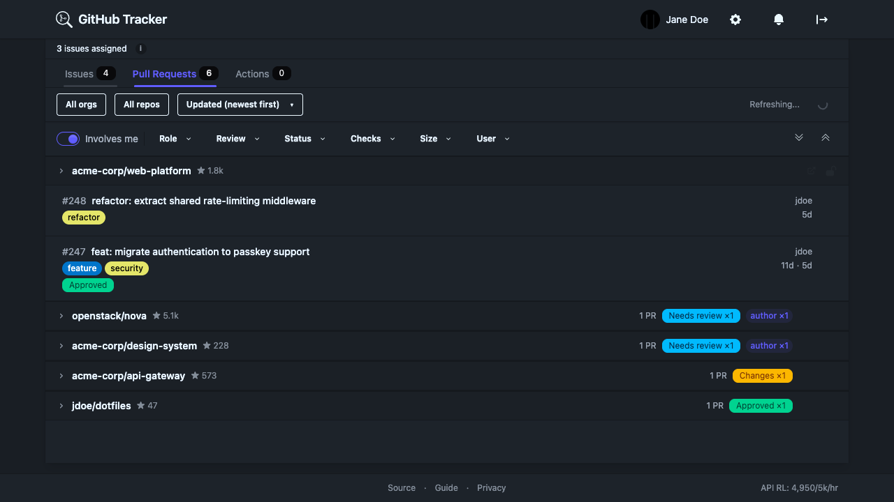
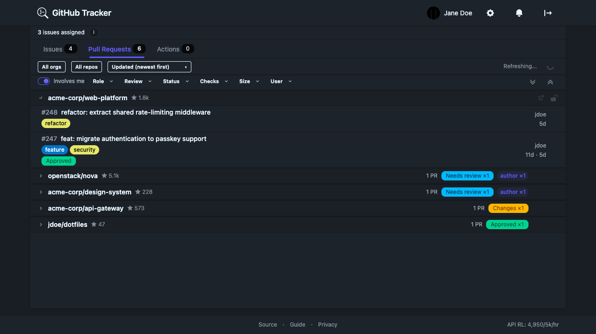

<p align="center">
  
</p>

# GitHub Tracker

A dashboard for tracking GitHub issues, PRs, and Actions workflow runs across many repos and orgs. Built with SolidJS, deployed on Cloudflare Workers.

**Live demo:** https://gh.gordoncode.dev

<table>
<tr>
<td align="center"><strong>Comfortable</strong></td>
<td align="center"><strong>Compact</strong></td>
</tr>
<tr>
<td></td>
<td></td>
</tr>
</table>

## Documentation

For detailed feature documentation, see the [User Guide](docs/USER_GUIDE.md).

## Features

### Issues

Open issues where you're the creator, assignee, or mentioned. A scope filter lets you toggle between "Involves me" and all activity in the repo. Role badges (author, assignee, mentioned) appear on each item. Dependency Dashboard issues — typically noisy bot aggregators — are hidden by default with a toggle to show them. Filterable, sortable, and paginated.

### Pull Requests

Open PRs with CI status dots (green/yellow/red), review decision badges, size badges (XS–XL by lines changed), and draft indicators. A "blocked" filter catches PRs where checks are failing or a review requested changes. The scope filter works here too. Reviewer avatars stack for multiple reviewers.

### Actions

Workflow runs grouped by repo and workflow name, with duration, triggering actor, and conclusion badges. Accordion collapse per group. A toggle hides runs triggered by PRs so you can focus on branch/schedule runs.

### Personal Summary Strip

A row of clickable stat chips at the top of the dashboard: assigned issues, PRs awaiting your review, PRs ready to merge, blocked PRs, and running Actions. Clicking any chip applies the matching filter on the relevant tab.

### Multi-User Tracking

Track other GitHub users' activity alongside your own. Add up to 10 users; each gets an independent global search across all selected repos. Bot accounts (GitHub App bots) are supported and labelled with a bot badge. Items surface the tracked user's avatar so you can see at a glance who triggered what.

### Monitor-All Mode

Per-repo opt-in to see all open issues and PRs in that repo, not just ones involving tracked users. Useful for repos where you want full visibility without filtering by involvement. Monitored repos show a "Monitoring all" badge on their group header.

### Upstream Repo Discovery

When you sign in, the app searches for repos you've interacted with that aren't in your selected list and offers to add them as "upstream" repos. These are included in issue/PR fetches but excluded from workflow run polling.

### Hot Polling

A second, faster poll loop (default 30s, configurable 10–120s) targets only in-flight items — PRs with pending CI checks and actively running workflow runs. These are updated via minimal GraphQL `nodes()` queries and individual REST calls rather than full re-fetches, keeping API usage low during active development.

### Desktop Notifications

Browser notifications for new issues, PRs, and failed runs. Per-type toggles in settings. Notification permission requested on first enable. Uses the GitHub Notifications API as a change-detection gate when the `notifications` scope is available.

### Repo Pinning and Reordering

Lock repos to the top of each tab's list so they don't shift around as activity changes. Drag-to-reorder within the locked set. Lock controls appear on hover on desktop, always visible on mobile.

### State Visibility

Shimmer animations on items being updated by the hot poll, flash highlights when values change (check status, review decision), and an inline peek on collapsed repo headers that shows what changed for 3 seconds. All animations respect `prefers-reduced-motion`.

### Star Counts

Star counts appear in repo group headers, fetched as part of the standard data refresh.

### Themes

9 themes: auto (follows system), corporate, cupcake, light, nord, dim, dracula, dark, forest. Theme is applied immediately on selection with no page reload.

### Ignore System

Hide specific items with a persistent ignore list. An "N ignored" badge on the repo group header lets you see what's hidden and unignore items without leaving the tab.

### ETag Caching and Auto-Refresh

Conditional requests using `If-None-Match` headers — GitHub doesn't count 304 responses against the rate limit. Background polling keeps data fresh even when the tab is hidden (when the notifications scope is available for efficient change detection).

## Tech Stack

- SolidJS + @solidjs/router
- Tailwind CSS v4 + daisyUI v5
- @kobalte/core (accessible headless UI primitives)
- TypeScript (strict)
- Vite 8 + @cloudflare/vite-plugin
- GitHub GraphQL + REST APIs via @octokit/core
- Cloudflare Workers (static assets + OAuth token exchange)
- Vitest 4 (happy-dom) + Playwright (E2E)
- pnpm

## Project Structure

```
src/
  shared/           # Browser-agnostic types, schemas, format utils shared with MCP server
  app/
    components/
      dashboard/    # DashboardPage, IssuesTab, PullRequestsTab, ActionsTab,
                    # ItemRow, WorkflowRunRow, WorkflowSummaryCard, IgnoreBadge,
                    # PersonalSummaryStrip
      layout/       # Header, TabBar, FilterBar
      onboarding/   # OnboardingWizard, OrgSelector, RepoSelector
      settings/     # SettingsPage, TrackedUsersSection, ThemePicker, Section, SettingRow
      shared/       # 19 shared components: FilterInput, FilterChips, StatusDot,
                    # ReviewBadge, SizeBadge, RoleBadge, SortDropdown, PaginationControls,
                    # LoadingSpinner, SkeletonRows, ToastContainer, NotificationDrawer,
                    # RepoLockControls, UserAvatarBadge, ExpandCollapseButtons,
                    # RepoGitHubLink, ChevronIcon, ExternalLinkIcon, Tooltip/InfoTooltip
    lib/            # 15 modules: format, errors, notifications, oauth, pat, url,
                    # flashDetection, grouping, reorderHighlight, collections,
                    # emoji, label-colors, sentry, mcp-relay, github-emoji-map.json
    pages/          # LoginPage, OAuthCallback, PrivacyPage
    services/
      api.ts        # GitHub API methods — issues, PRs, workflow runs, user validation,
                    # upstream repo discovery, tracked user search
      github.ts     # Octokit client factory with ETag caching and rate limit tracking
      poll.ts       # Poll coordinator: 5-min full refresh + hot poll loop
    stores/
      auth.ts       # OAuth/PAT token management, localStorage persistence
      cache.ts      # IndexedDB cache with TTL eviction and ETag support
      config.ts     # Zod v4-validated config with localStorage persistence
      view.ts       # View state (tabs, sorting, filters, ignored items, locked repos)
  worker/
    index.ts        # OAuth token exchange endpoint, CORS, security headers
mcp/
  src/              # MCP server: tools, resources, WebSocket relay, Octokit fallback
  tests/            # MCP server unit + integration tests
tests/              # SPA unit/component tests
e2e/                # Playwright E2E tests
```

## Development

```sh
pnpm install
pnpm run dev        # Start Vite dev server
pnpm test           # Run unit/component tests
pnpm test:e2e       # Run Playwright E2E tests
pnpm run typecheck  # TypeScript check
pnpm run build      # Production build
pnpm run screenshot # Capture dashboard screenshot
```

## Security

OAuth tokens are stored in `localStorage` under an app-specific key — this is standard for single-user personal dashboards and matches the threat model here. CSP headers block script injection via Cloudflare (`script-src 'self'` with a SHA-256 exception for the dark-mode initialization script only). An Octokit hook blocks all non-GET requests except `POST /graphql` as a read-only guard — the `repo` scope is required for private repo access, but the app never performs writes. OAuth state is generated with `crypto.getRandomValues` and verified on callback. Token validation runs on every page load via `GET /user`; a 401 clears the stored token immediately.

## Deployment

See [DEPLOY.md](./DEPLOY.md) for Cloudflare, OAuth App, and CI/CD setup.

## MCP Server

An optional MCP (Model Context Protocol) server lets AI clients like Claude Code and Cursor query your dashboard data — open PRs, issues, failing CI — without leaving the editor. See the [MCP server README](mcp/README.md) for setup, available tools, and configuration.

## Contributing

See [CONTRIBUTING.md](./CONTRIBUTING.md).
